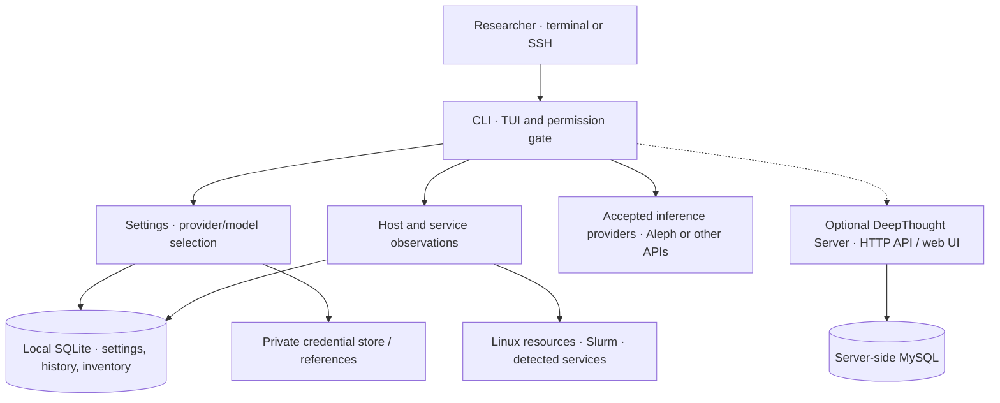

<p align="center">
  
</p>

# DeepThought — A Research Computing Harness

[](./LICENSE)
[](https://github.com/ualberta-rcg/deepthought/actions/workflows/build-cli.yml)
[](https://github.com/ualberta-rcg/deepthought/actions/workflows/build-server.yml)
[](https://github.com/ualberta-rcg/deepthought/releases/tag/edge)
[](https://hub.docker.com/r/rkhoja/deepthought-server)

> **Understand your machine. Configure your models. Get on with research.**
>
> *Don't Panic. Bring a towel.*

*Developed for research computing in the [University of Alberta](https://www.ualberta.ca/en/information-services-and-technology/research-computing/index.html) / [AMII](https://www.amii.ca/) environment, including Vulcan and other Linux research machines.*

**Maintained by:** Rahim Khoja ([khoja1@ualberta.ca](mailto:khoja1@ualberta.ca)) and Karim Ali ([kali2@ualberta.ca](mailto:kali2@ualberta.ca))

[Get started](#get-started) · [Capabilities](#capabilities) · [Architecture](#architecture) · [Documentation](#documentation) · [Support](#-support)

[DeepThought Server](https://deepthought.vulcan.alliancecan.ca/) · [Aleph model catalog](https://inference.vulcan.alliancecan.ca/) · [Alliance documentation](https://docs.alliancecan.ca/)

---

## Overview

DeepThought is a terminal application for research computing. It combines a
permission-gated AI assistant with information about the host, its services, and
the user's Slurm jobs. Researchers can use it for code, shell work, scientific
planning, and managing work that continues across terminal disconnects.

The CLI opens without a model or network connection. Settings, navigation, and
host information remain available while inference is unconfigured or unavailable.
DeepThought runs locally or serves its terminal interface over SSH. Its optional
server provides shared settings and chat storage; standalone operation remains
independent of that server.

## Get started

```bash
curl -fsSL https://raw.githubusercontent.com/ualberta-rcg/deepthought/main/install.sh | bash
deepthought-cli
```

The installer downloads the rolling `edge` Linux/amd64 binary into `~/.local/bin`
without root access. It verifies the checksum when the release supplies one.
Ensure `~/.local/bin` is on your `PATH`. See [setup and configuration](docs/SETUP.md)
for install-directory overrides, migration, and credential handling.

On first use of a host, DeepThought looks for supported local provider
configuration after the interface opens. Review detected endpoints and masked
credentials before accepting one. Acceptance saves the provider and fetches its
models; select a model to begin. Skip setup at any time and return through
**Ctrl+P → Discover AI providers**, or configure a provider manually in Settings.

On Vulcan, Aleph supplies `TYK_KEY` in `~/.aleph_tyk.env`. The file can take a few
minutes to appear after first login. DeepThought offers retry; you do not need to
source it or copy the key into a settings file. One key covers all Aleph models.
The OpenAI-compatible base is `https://inference.vulcan.alliancecan.ca/v1`.

| I want to… | Start here |
|---|---|
| Configure inference | Settings → Setup / Providers / Models |
| See all navigation actions | Ctrl+P; function keys are optional shortcuts |
| Inspect this machine | Status or Hosts & Services |
| See my scheduler work | Jobs and the chat sidebar |
| Keep a session across disconnects | `deepthought-cli --towel`; Ctrl+\ detaches |
| Reattach | `deepthought-cli ls`, then `deepthought-cli attach <id>` |
| Connect to DeepThought Server | Settings → Server, then welcome-screen server login |
| Install elsewhere | Navigation → Help / install on another machine |

## Capabilities

- **Settings-driven setup** — reviewed credential discovery, provider editing,
  advertised model capabilities, manual model entry, and cached catalogs.
- **Local persistence** — SQLite settings and history, migration from existing
  configuration, separate credentials, and explicit file overrides.
- **Research assistance** — OpenAI- and Anthropic-compatible inference, workspace
  tools, skills, context management, and permission-gated shell actions.
- **Host awareness** — host/service inventory, freshness indicators, memory and
  CPU measurements, current allocation, and filesystem capacity.
- **Slurm awareness** — the user's jobs, pending reasons, accounts, fairshare,
  and cluster summaries, collected with conservative caching and timeouts.
- **Resident sessions** — continue local sessions across terminal disconnects;
  process loss restores interrupted history without replaying tools.
- **Scientific workflows** — explicit objectives, durable job submission records,
  validation evidence, and configured scientific endpoints.

Host capacity is not automatically available to a job. The interface distinguishes
physical capacity, allocation, utilization, and filesystem capacity. Fairshare is
a scheduling factor, not a queue position or promised start time. Unknown or
inaccessible observations remain unknown.

## Architecture

Two independent Go modules share a compatible conversation wire format:



`deepthought-cli/` owns the terminal interface, local runtime, SQLite state, and
host observations. `deepthought-server/` owns its HTTP API, web UI, and MySQL.
The server has no CLI dependency; the CLI reaches it over HTTP. Portable settings
synchronization excludes credentials and local host inventory.

Client, host, cluster, and service identities are separate. Inventory retains
latest observations, preparing for multiple research machines without requiring
a distributed control plane. Remote execution and automatic cooperation between
clients are not implemented by this inventory layer.

## Builds and releases

GitHub Actions vets, tests, race-checks, and builds the CLI. Successful main
builds publish the rolling `edge` binary and checksum. Feature-branch checks do
not publish releases. The separate server workflow builds and pushes its Docker
image; publishing an image does not change the deployed Kubernetes image pin.

Do not build or run heavy workloads on shared HPC login nodes. Development
validation for this repository runs in CI. See the [repository rules](CLAUDE.md)
and [CLI operations](deepthought-cli/docs/LOCAL-OPERATIONS.md).

## Documentation

| Guide | Purpose |
|---|---|
| [Setup and configuration](docs/SETUP.md) | Discovery, credentials, precedence, migration |
| [Host and service awareness](docs/HOSTS.md) | Inventory, refresh intervals, allocation and freshness |
| [CLI operations](deepthought-cli/docs/LOCAL-OPERATIONS.md) | Resident sessions, jobs, workflows, releases |
| [CLI architecture](deepthought-cli/CLAUDE.md) | Runtime conventions and implementation background |
| [Server](deepthought-server/README.md) | Independent server module and database |
| [Changelog](CHANGELOG.md) | Changes and verification evidence |

## 🔗 References

- [University of Alberta Research Computing](https://www.ualberta.ca/en/information-services-and-technology/research-computing/index.html)
- [Aleph inference service](https://github.com/ualberta-rcg/aleph)
- [Alliance documentation](https://docs.alliancecan.ca/)
- [AMII engineering documentation](https://docs.engineering.amii.ca/)

---

## 🤝 Support

Many Bothans died to bring us this information. This project is provided as-is, but reasonable questions may be answered based on my coffee intake or mood. ;)

Feel free to [open an issue](https://github.com/ualberta-rcg/deepthought/issues) or email **[khoja1@ualberta.ca](mailto:khoja1@ualberta.ca)** or **[kali2@ualberta.ca](mailto:kali2@ualberta.ca)** for U of A related deployments.

Keep credentials and private research data out of issues, screenshots, and support requests.

## 📜 License

This project is released under the **MIT License** — use it, modify it, distribute it, include it in proprietary software. Keep the copyright notice. That's it.

**Full license text:** [MIT License](./LICENSE)

## 🧠 About University of Alberta Research Computing

The [Research Computing Group](https://www.ualberta.ca/en/information-services-and-technology/research-computing/index.html) supports high-performance computing, data-intensive research, and advanced infrastructure for researchers at the University of Alberta and across Canada.

We help design and operate compute environments that power innovation — from AI training clusters to national research infrastructure.
